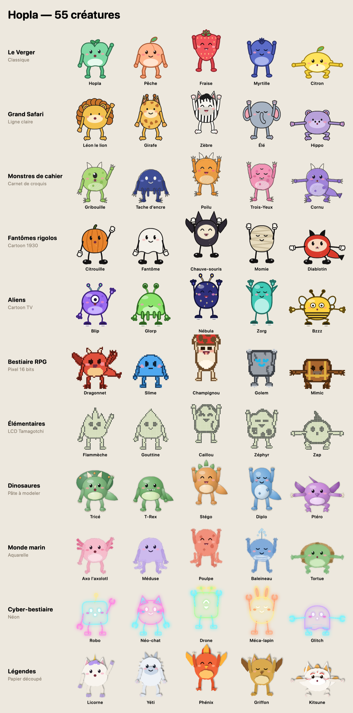
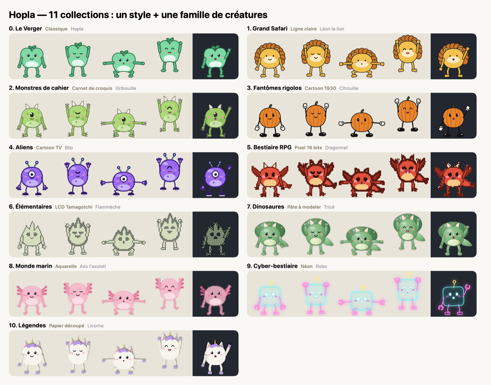

<p align="center"></p>

<h1 align="center">Hopla</h1>

<p align="center"><b>A tiny desk buddy for macOS that gets you moving.</b></p>

<p align="center">
  <a href="https://github.com/JustinSimonToSpace/hopla/actions/workflows/ci.yml"></a>
  
  
</p>

A few times a day, a little creature hops into the corner of your screen — no window, just the creature —
and invites you to move. Say **Go** and follow along: it does the moves with you, then celebrates and
disappears until next time. Not now? Tap **Later**.

<!-- A short GIF of Hopla in action goes here: docs/hopla.gif -->



## Install

1. Download `Hopla-x.y.z.zip` from the [latest release](https://github.com/JustinSimonToSpace/hopla/releases/latest)
   and unzip it.
2. Move **Hopla.app** to your Applications folder and open it. Hopla lives in the menu bar (no Dock icon).
3. The app isn't notarized by Apple yet, so macOS warns you the first time. Open
   **System Settings → Privacy & Security** and click **Open Anyway** (or right-click Hopla.app → Open).

Works on Apple Silicon and Intel Macs running macOS 13 Ventura or later.

## Features

- **55 creatures in 11 collections** — each one an art style *and* a creature family: fruits (classic),
  safari animals (clear-line comics), notebook monsters (pencil sketch), silly spooks (1930s rubber hose),
  aliens (TV cartoon), RPG bestiary (16-bit pixels), elementals (Tamagotchi LCD), dinosaurs (claymation),
  sea creatures (watercolor), cyber bestiary (neon), legends (paper cut).
- **An articulated skeleton drawn by code**: arms, legs, elbows and knees, hands that follow the forearm,
  feet that stay planted — every creature can do every move.
- **18 gentle moves** (11 seated, 7 standing) and **10 pre-recorded routes per session length**
  (30 s, 45 s, 1 min, 2 min), with a short pause to stand up or sit down between seated and standing moves.
  Routes change at every visit (never the same twice a day), daily, weekly, monthly, or never.
- **Your routine, your rules**: seated-only mode, uncheck any exercise (it's swapped for a similar one),
  frequency, hours, days, pause.
- **Avatar editor**: shape, ears, 30+ anatomy extras (horns, wings, trunk, shell, nine tails…), hands and
  feet, every color. Avatars are small JSON files you can share.
- **Sounds synthesized on the fly**: each collection has its own voice, each creature its own pitch.
- **Polite**: stays away during calls and screen sharing; time away from the Mac (or asleep) counts as a
  break; never steals your keyboard focus.
- **Progress**: daily goal, streak, 18-week calendar.
- French and English, launch at login, global shortcuts (⌃⌥H call / Go, ⌃⌥S later / stop), size,
  corner or drag-to-place, choice of screen, and support for the macOS *Reduce motion* setting.



## Privacy

Hopla **never connects to the internet** and collects nothing. It only stores its settings, your break
history and your custom avatars on your Mac. To stay quiet during calls it checks *whether* the camera or a
microphone is currently in use by another app, and whether the screen is being shared — it never accesses
the camera image, the sound or the screen content, so it needs no permission.

Detecting screen sharing relies on a private window-server function looked up at runtime
(`SLSIsScreenWatcherPresent`), as macOS has no public API for it. If a future macOS removes it, Hopla simply
assumes the screen isn't shared. This is also why Hopla can't be published on the Mac App Store as is.

## Health

Hopla suggests short, gentle movements to break up long sitting sessions. It is **not medical advice** and
not a substitute for a professional. Go at your own pace, skip anything that doesn't suit your body, and stop
if something hurts. Seated-only mode and the exercise list let you tailor every session.

## Build from source

Requires macOS 13+ and the Swift toolchain (Xcode or the Command Line Tools).

```sh
./scripts/make-app.sh            # dist/Hopla.app for this Mac (add --universal for Apple Silicon + Intel)
open dist/Hopla.app
./scripts/test.sh                # unit tests
./scripts/release.sh             # tests + universal app + zip and SHA-256 for a GitHub release
```

Developer flags (`swift run Hopla <flag>`):

| Flag | Effect |
|---|---|
| `--now` | Hopla shows up right away |
| `--fast` | Exercises last a few seconds |
| `--settings` | Opens the settings window |
| `--render <dir>` | PNG boards: catalog, collections, hands & feet, exercises, bubbles, social preview |
| `--selftest <dir>` | Drives full visits in the real panel (clicks included), exits non-zero on failure |
| `--snapshot-settings <dir>` | Renders each settings tab off-screen |
| `--icon <dir>` | Writes the app icon set |

## Project layout

```
Sources/Hopla/
  Rig/    Pose & clips, skeleton geometry (Figure), creature anatomy, hands & feet, all moves
  Art/    Art styles and the painter that renders a figure in each of them
  Core/   Life cycle, scheduler, routes & exercises, settings, stats, catalog, sounds, system hooks, labels
  UI/     Transparent panel, bubble, settings window, avatar editor, menu bar, icon, render & self-test tools
Tests/HoplaTests/   Routes, scheduling, stats, avatar-file safety, drawing every creature in every move
```

## Contributing

New creatures, collections, moves and translations are very welcome — see [CONTRIBUTING.md](CONTRIBUTING.md)
and the [code of conduct](CODE_OF_CONDUCT.md). Contributors sign a short [CLA](CLA.md) once, in one click on
their first pull request. Security issues: see [SECURITY.md](SECURITY.md).

## Credits

Created by [Justin Simon](https://github.com/JustinSimonToSpace). Everything — creatures, animations, sounds
and icon — is drawn or synthesized by code, with no third-party assets or dependencies. Inspired by the
long tradition of desktop pets and Tamagotchis.

## License

Hopla is **source available** under the [PolyForm Noncommercial License 1.0.0](LICENSE) © 2026 Justin Simon.

- ✅ Free for personal use, hobby projects, study, and non-profit, educational or public organizations —
  use it, modify it, share it.
- ❌ No commercial use: you can't sell Hopla, include it in a paid product or service, or use it to make money.
  For a commercial license, open an issue or contact [Justin Simon](https://github.com/JustinSimonToSpace).

The name "Hopla" and its icon are not covered by the license: forks need their own name and icon
(see [TRADEMARKS.md](TRADEMARKS.md)).
